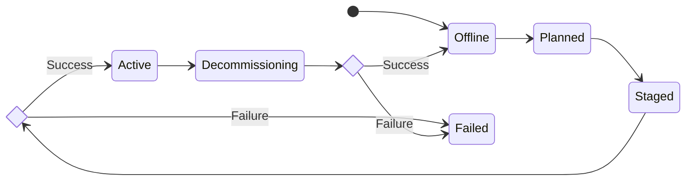

# MachineCFG

[](https://goreportcard.com/report/github.com/mgrzybek/machinecfg)


**MachineCFG** is a specialized CLI tool designed to bridge the gap between your Inventory Management System (**NetBox**) and your provisioning stack (**Tinkerbell** or **Talos Linux**).

It automates the generation of configuration files by fetching hardware data and mapping them to **Butane/Ignition** configurations, **Tinkerbell Hardware** objects or **Talos MachineConfig patches** .

---

## ✨ Key Features

* **NetBox Integration:** Automatically fetches device details, MAC addresses, and roles via the NetBox API.
* **Butane Templating:** Converts YAML Butane configurations into JSON Ignition files on the fly.
* **Tinkerbell Automation:** Generates the necessary Hardware objects to deploy devices using a MaaS
* **Talos Linux Automation:** Generates the necessary Machine patches to manage networking.
* **Infrastructure as Code:** Ensures your physical deployment matches your "Source of Truth".


## 🚀 Getting Started

### Prerequisites

* **Go** (version 1.25.4 or higher)
* A running **NetBox** instance with an API token.
* **Devices** properly configured in Netbox in order to be managed.
* A working **Kubernetes cluster** for some features.

### Installation

Using `task`:

```bash
task cli
```

Using Nix:

```bash
nix-build
```

## ⚙️ Configuration

MachineCFG requires access to your NetBox instance. Set the following environment variables:

| Variable       | Description
|----------------|-------------
| `NETBOX_URL`   | The base URL of your NetBox instance (e.g., https://netbox.example.com)
| `NETBOX_TOKEN` | Your NetBox API Token

Netbox-side, devices' statuses are very important. They allow the tool to know which device to create and delete.

| Device status   | Tinkerbell action
|-----------------|------------------
| Offline         | The device is not connected. The `Hardware` should deleted.
| Planned         | The device is not ready yet but you know where to install it.
| Staged          | The device is ready for commissioning. The `Hardware` can be created.
| Active          | The `Workflow` succeeded. The status has been updated to "Active".
| Decommissioning | The device needs to be decommissioned from a cluster. Some cleanup `Workflow` can be triggered too.
| Failed          | The `Workflow` failed.

Here is a typical workflow.



## 🛠 Usage

The tool operates by mapping NetBox ressources to create configuration objects.

| Command               | Description
|-----------------------|-------------
| `butane` / `ignition` | Manage butane / ignition configurations
| `talos`               | Manage Talos Linux
| `tinkerbell`          | Manage Tinkerbell objects

### Create Tinkerbell Hardware objects

Embed Fedora CoreOS vendor data and add objects directly into Kubernetes.

```bash
./machinecfg \
    --netbox-endpoint $NETBOX_ENDPOINT --netbox-token $NETBOX_TOKEN \
    --sites paris-dc1 --roles cattle
  tinkerbell hardware \
    --embed-ignition-as-vendor-data \
    --embedded-ignition-variant=fcos
```

### Create Ignition files

Write an `.ign` file per device into `/tmp`, using Flatcar variant.

```bash
./machinecfg \
    --netbox-endpoint $NETBOX_ENDPOINT --netbox-token $NETBOX_TOKEN \
    --sites maison --roles cattle \
  ignition flatcar \
    --output-directory /tmp
```

### Create Talos Linux patches

```bash
./machinecfg \
    --netbox-endpoint $NETBOX_ENDPOINT --netbox-token $NETBOX_TOKEN \
    --sites paris-dc1 --roles cattle \
  talos machineconfig \
    --output-directory /tmp
```
