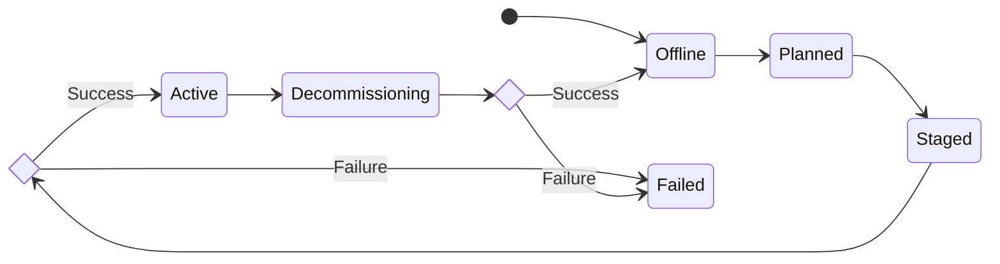

# MachineCFG

[](https://goreportcard.com/report/github.com/mgrzybek/machinecfg)


**MachineCFG** is a specialized CLI tool designed to bridge the gap between your Inventory Management System (**NetBox**) and your provisioning stack (**Tinkerbell** or **Talos Linux**).

It automates the generation of configuration files by fetching hardware data and mapping them to **Butane/Ignition** configurations, **Tinkerbell Hardware** objects or **Talos MachineConfig patches**.

---

## ✨ Key Features

* **NetBox Integration:** Automatically fetches device details, MAC addresses, and roles via the NetBox API.
* **Butane Templating:** Converts YAML Butane configurations into JSON Ignition files on the fly.
* **Tinkerbell Automation:** Generates and reconciles Hardware objects to deploy devices using a MaaS.
* **Talos Linux Automation:** Generates the necessary Machine patches to manage networking.
* **Infrastructure as Code:** Ensures your physical deployment matches your "Source of Truth".


## 🚀 Getting Started

### Prerequisites

* **Go** (version 1.25.4 or higher)
* A running **NetBox** instance with an API token.
* **Devices** properly configured in NetBox in order to be managed.
* A working **Kubernetes cluster** for some features.

### Installation

Using `task`:

```bash
task cli
```

Using Nix:

```bash
nix-build
```

## ⚙️ Configuration

### NetBox credentials

MachineCFG requires access to your NetBox instance. Credentials can be supplied via flags or environment variables (flags take precedence).

| Flag                 | Environment variable  | Description                                              |
|----------------------|-----------------------|----------------------------------------------------------|
| `--netbox-endpoint`  | `NETBOX_ENDPOINT`     | Base URL of your NetBox instance (e.g. `https://netbox.example.com`) |
| `--netbox-token`     | `NETBOX_TOKEN`        | NetBox API token (40 characters)                         |

### Kubernetes configuration

| Flag            | Environment variable | Description                                              |
|-----------------|----------------------|----------------------------------------------------------|
| `--kubeconfig`  | `KUBECONFIG`         | Path to kubeconfig file (flag overrides env var; falls back to `~/.kube/config`) |

### NetBox conventions

A custom field called `Domains` can be added to `IPAM/Prefix` in order to manage the `systemd-networkd` option [Domains](https://www.freedesktop.org/software/systemd/man/latest/systemd.network.html#Domains=).

The hostname set in `/etc/hostname` of generated Ignition files is derived from the **DNS name** of the device's primary IPv4 address (or primary IP if no IPv4 is set). If no DNS name is configured, the device name is used as a fallback.

#### Inventory items

`Hardware.spec.disks` is populated from the device's inventory items. Each item whose **role slug** is `system-disk` is mapped to a disk entry, using the item's **name** as the device path (e.g. `/dev/nvme0n1`).

If no `system-disk` inventory item is found for a device, the Hardware object is **not created** and an error is logged.

| NetBox object | Field | Required value |
|---|---|---|
| DCIM / Inventory item | Role slug | `system-disk` |
| DCIM / Inventory item | Name | Device path (e.g. `/dev/sda`, `/dev/nvme0n1`) |

Device statuses in NetBox drive the Hardware lifecycle:

| Device status   | Tinkerbell action                                                                    |
|-----------------|--------------------------------------------------------------------------------------|
| Offline         | The device is not connected. The `Hardware` object is deleted.                       |
| Planned         | The device is not ready yet but its location is known.                               |
| Staged          | The device is ready for commissioning. The `Hardware` object is created.             |
| Active          | The `Workflow` succeeded. Status updated automatically by `sync-status` or `sync`.   |
| Decommissioning | The device needs to be decommissioned. A cleanup `Workflow` can be triggered.        |
| Failed          | The `Workflow` failed.                                                               |


```mermaid
stateDiagram-v2
  direction LR

  state if_failure_staged <<choice>>
  state if_failure_deco <<choice>>

  [*] --> Offline
  Offline --> Planned
  Planned --> Staged
  Staged --> if_failure_staged
  if_failure_staged --> Active: Success
  if_failure_staged --> Failed: Failure
  Active --> Decommissioning
  Decommissioning --> if_failure_deco
  if_failure_deco --> Offline: Success
  if_failure_deco --> Failed: Failure
```

## 🛠 Usage

| Command               | Description                                    |
|-----------------------|------------------------------------------------|
| `butane` / `ignition` | Manage Butane / Ignition configurations        |
| `talos`               | Manage Talos Linux machine config patches      |
| `tinkerbell`          | Manage Tinkerbell Hardware objects             |

Global filter flags available on all commands:

| Flag             | Description                                      |
|------------------|--------------------------------------------------|
| `--sites`        | Filter by NetBox site names (required)           |
| `--roles`        | Filter by NetBox device roles (required)         |
| `--regions`      | Filter by NetBox region names                    |
| `--locations`    | Filter by NetBox location names                  |
| `--tenants`      | Filter by NetBox tenant names                    |
| `--racks`        | Filter by rack IDs                               |
| `--clusters`     | Filter by NetBox cluster names                   |
| `--virtualization` | Use virtual machines instead of physical devices |

---

### Tinkerbell Hardware

#### Sync Hardware objects

Create Hardware objects for `staged` devices and delete them for `offline`/`planned` devices.
When an object already exists, its labels are reconciled with the current NetBox state. If the
Hardware carries the `v1alpha1.tinkerbell.org/provisioned: "true"` annotation and the corresponding
NetBox device is still `staged`, the device is automatically transitioned to `active`.

```bash
./machinecfg \
    --netbox-endpoint $NETBOX_ENDPOINT --netbox-token $NETBOX_TOKEN \
    --sites paris-dc1 --roles cattle \
  tinkerbell hardware sync
```

Embed Fedora CoreOS vendor data:

```bash
./machinecfg \
    --netbox-endpoint $NETBOX_ENDPOINT --netbox-token $NETBOX_TOKEN \
    --sites paris-dc1 --roles cattle \
  tinkerbell hardware sync \
    --embed-ignition-as-vendor-data \
    --embedded-ignition-variant=fcos
```

Export as YAML files instead of applying to Kubernetes:

```bash
./machinecfg \
    --netbox-endpoint $NETBOX_ENDPOINT --netbox-token $NETBOX_TOKEN \
    --sites paris-dc1 --roles cattle \
  tinkerbell hardware sync \
    --output-directory /tmp
```

> Each generated `Hardware` object carries a `netbox-device-id` label for unambiguous traceability back to its NetBox source.

#### Show Hardware objects

Display all Hardware objects in a namespace with their PXE, Workflow and CAPI cluster membership:

```bash
./machinecfg tinkerbell hardware show \
    --namespace my-tenant
```

Example output:

```console
HOSTNAME           STATUS    ALLOW-PXE   WORKFLOW   CLUSTER
server-paris-01    staged    true        true
server-paris-02    active    false       false       cluster-0
server-paris-03    offline   false       false
```

The `CLUSTER` column is resolved by traversing the ownership chain
`Hardware → TinkerbellMachine → cluster.x-k8s.io/cluster-name`.

Filter to a single machine:

```bash
./machinecfg tinkerbell hardware show \
    --namespace my-tenant \
    --hostname server-paris-02
```

Output as JSON (logs are suppressed automatically):

```bash
./machinecfg tinkerbell hardware show \
    --namespace my-tenant \
    --output json | jq '.[].cluster'
```

#### Sync NetBox device status

Transition `staged` NetBox devices to `active` for all Hardware objects in a namespace
whose `v1alpha1.tinkerbell.org/provisioned` annotation is `"true"`.
Only devices that are currently `staged` are updated (`updated: true`).

```bash
./machinecfg \
    --netbox-endpoint $NETBOX_ENDPOINT --netbox-token $NETBOX_TOKEN \
    --sites paris-dc1 --roles cattle \
  tinkerbell hardware sync-status \
    --namespace my-tenant
```

Output as JSON:

```bash
./machinecfg ... tinkerbell hardware sync-status \
    --namespace my-tenant \
    --output json | jq '.[] | select(.updated)'
```

#### Enable / disable PXE boot

Enable PXE boot (`AllowPXE=true`) on all Hardware objects in a namespace:

```bash
./machinecfg tinkerbell hardware pxe-allow \
    --namespace my-tenant
```

Target a single machine:

```bash
./machinecfg tinkerbell hardware pxe-allow \
    --namespace my-tenant \
    --hostname my-server
```

The aliases `allow-pxe` and `deny-pxe` are also available for `pxe-allow` and `pxe-deny`.

#### Clean userData / vendorData

Wipe the `userData` field (e.g. after a reprovisioning cycle):

```bash
./machinecfg tinkerbell hardware clean-userdata \
    --namespace my-tenant

./machinecfg tinkerbell hardware clean-userdata \
    --namespace my-tenant \
    --hostname my-server
```

Wipe the `vendorData` field (forces a fresh embedded Ignition config on next provisioning):

```bash
./machinecfg tinkerbell hardware clean-vendordata \
    --namespace my-tenant
```

---

### Create Ignition files

Write an `.ign` file per device into `/tmp`, using Flatcar variant:

```bash
./machinecfg \
    --netbox-endpoint $NETBOX_ENDPOINT --netbox-token $NETBOX_TOKEN \
    --sites maison --roles cattle \
  ignition flatcar \
    --output-directory /tmp
```

---

### Create Talos Linux patches

```bash
./machinecfg \
    --netbox-endpoint $NETBOX_ENDPOINT --netbox-token $NETBOX_TOKEN \
    --sites paris-dc1 --roles cattle \
  talos machineconfig \
    --output-directory /tmp
```
