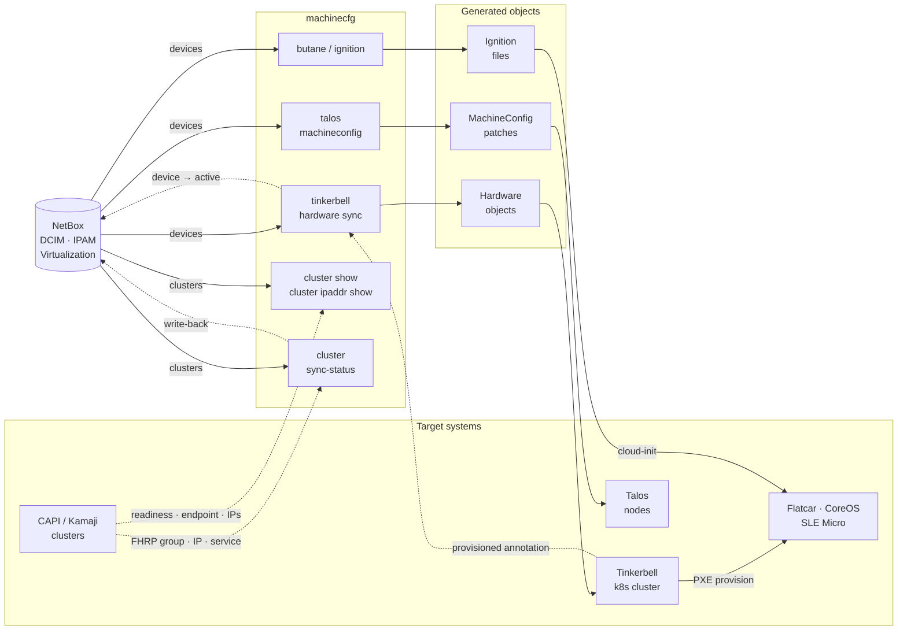
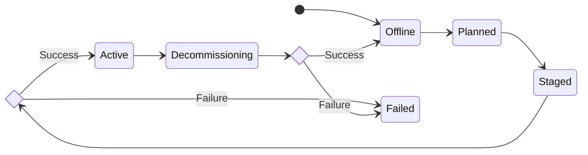

# MachineCFG

**MachineCFG** is a set of specialized tools designed to bridge the gap between your Inventory Management System (**NetBox**) and your provisioning stack (**Tinkerbell**, **Flatcar Linux**, **Talos Linux** or **Kamaji**).

It automates the generation of configuration files by fetching hardware data and mapping them to **Butane/Ignition** configurations, **Tinkerbell Hardware** objects or **Talos MachineConfig patches**. It also provides unified visibility over Kubernetes cluster membership by crossing NetBox virtualization records with live CAPI / Kamaji cluster state.

---

## ✨ Key Features

* **NetBox Integration:** Automatically fetches device details, MAC addresses, and roles via the NetBox API.
* **Butane Templating:** Converts YAML Butane configurations into JSON Ignition files on the fly.
* **Tinkerbell Automation:** Generates and reconciles Hardware objects to deploy devices using a MaaS.
* **Talos Linux Automation:** Generates the necessary Machine patches to manage networking.
* **Cluster Visibility:** Cross-references NetBox virtualization clusters with live CAPI / Kamaji state — readiness, control-plane endpoint, Cilium LB-IPAM addresses, Tailscale-exposed endpoints and member devices in a single view.
* **NetBox Write-back:** Reconciles FHRP groups, IP addresses (with DNS name), ServiceTemplates and Services in NetBox from observed Kubernetes cluster state.
* **Infrastructure as Code:** Ensures your physical deployment matches your "Source of Truth".

```mermaid
flowchart LR
    NB[(NetBox<br>DCIM · IPAM<br>Virtualization)]

    subgraph mcfg[machinecfg]
        TB[tinkerbell<br>hardware sync]
        TL[talos<br>machineconfig]
        BT[butane / ignition]
        CS[cluster show<br>cluster ipaddr show]
        SS[cluster<br>sync-status]
    end

    subgraph out[Generated objects]
        HW[Hardware<br>objects]
        MC[MachineConfig<br>patches]
        IGN[Ignition<br>files]
    end

    subgraph targets[Target systems]
        TBK[Tinkerbell<br>k8s cluster]
        TALOS[Talos<br>nodes]
        LX[Flatcar · CoreOS<br>SLE Micro]
        CAPI[CAPI / Kamaji<br>clusters]
    end

    NB -->|devices| TB
    NB -->|devices| TL
    NB -->|devices| BT
    NB -->|clusters| CS
    NB -->|clusters| SS

    TB --> HW
    TL --> MC
    BT --> IGN

    HW --> TBK
    TBK -->|PXE provision| LX
    MC --> TALOS
    IGN -->|cloud-init| LX

    TBK -.->|provisioned annotation| TB
    TB -.->|device → active| NB
    CAPI -.->|readiness · endpoint · IPs| CS
    CAPI -.->|FHRP group · IP · service| SS
    SS -.->|write-back| NB
```

## 🚀 Getting Started

### Prerequisites

* **Go** (version 1.25.4 or higher)
* A running **NetBox** instance with an API token.
* **Devices** properly configured in NetBox in order to be managed.
* A working **Kubernetes cluster** for some features.

### NetBox conventions

A custom field called `Domains` can be added to `IPAM/Prefix` in order to manage the `systemd-networkd` option [Domains](https://www.freedesktop.org/software/systemd/man/latest/systemd.network.html#Domains=).

The hostname set in `/etc/hostname` of generated Ignition files is derived from the **DNS name** of the device's primary IPv4 address (or primary IP if no IPv4 is set). If no DNS name is configured, the device name is used as a fallback.

#### Inventory items

`Hardware.spec.disks` is populated from the device's inventory items. Each item whose **role slug** is `system-disk` is mapped to a disk entry, using the item's **name** as the device path (e.g. `/dev/nvme0n1`).

If no `system-disk` inventory item is found for a device, the Hardware object is **not created** and an error is logged.

| NetBox object | Field | Required value |
|---|---|---|
| DCIM / Inventory item | Role slug | `system-disk` |
| DCIM / Inventory item | Name | Device path (e.g. `/dev/sda`, `/dev/nvme0n1`) |

Device statuses in NetBox drive the Hardware lifecycle:

| Device status   | Tinkerbell action                                                                    |
|-----------------|--------------------------------------------------------------------------------------|
| Offline         | The device is not connected. The `Hardware` object is deleted.                       |
| Planned         | The device is not ready yet but its location is known.                               |
| Staged          | The device is ready for commissioning. The `Hardware` object is created.             |
| Active          | The `Workflow` succeeded. Status updated automatically by `sync-status` or `sync`.   |
| Decommissioning | The device needs to be decommissioned. A cleanup `Workflow` can be triggered.        |
| Failed          | The `Workflow` failed.                                                               |

```mermaid
stateDiagram-v2
  direction LR

  state if_failure_staged <<choice>>
  state if_failure_deco <<choice>>

  [*] --> Offline
  Offline --> Planned
  Planned --> Staged
  Staged --> if_failure_staged
  if_failure_staged --> Active: Success
  if_failure_staged --> Failed: Failure
  Active --> Decommissioning
  Decommissioning --> if_failure_deco
  if_failure_deco --> Offline: Success
  if_failure_deco --> Failed: Failure
```

## The tools

* [The command-line interface](./CLI.md): directly used by admins.
* [The Kubernetes controllers](./CONTROLLERS.md): installed within the management cluster.
