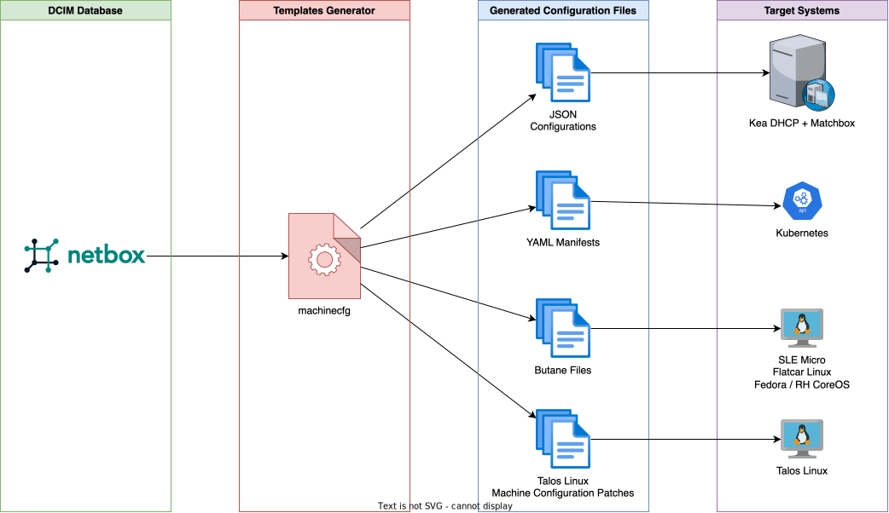

# machinecfg

Create machine configuration using Netbox and Matchbox.



## Usage

### Help message

```console
$ ./machinecfg --help
Usage:
  machinecfg [command]

Available Commands:
  butane      Manage butane / ignition configurations
  completion  Generate the autocompletion script for the specified shell
  help        Help about any command
  talos       Manage Talos Linux
  tinkerbell  Manage Tinkerbell objects

Flags:
      --clusters string           Apply a filter on the given clusters
  -h, --help                      help for machinecfg
      --locations string          Locations to extract data from
      --log-level string          Log level ’development’ (default) or ’production’
      --netbox-endpoint string    URL of the API
      --netbox-token string       Token used to call Netbox API
      --output-directory string   Where to write the result
      --racks string              Apply a filter on the given racks
      --regions string            Regions to extract data from
      --roles string              Apply a filter on the given roles
      --sites string              Sites to extract data from
      --tenants string            Tenants to extract data from
      --virtualization            Use the virtual machines' inventory instead of the physical devices

Use "machinecfg [command] --help" for more information about a command.
```

## Netbox integration

| Device status   | Tinkerbell action |
|-----------------|-------------------|
| Offline         | The device is not connected. The `Hardware` should deleted. |
| Planned         | The device is not ready yet but you know where to install it. |
| Staged          | The device is ready for commissioning. The `Hardware` can be created. |
| Active          | The `Workflow` succeeded. The status has been updated to "Active". |
| Decommissioning | The device needs to be decommissioned from a cluster. Some cleanup `Workflow` can be triggered too. |
| Failed          | The `Workflow` failed. |


